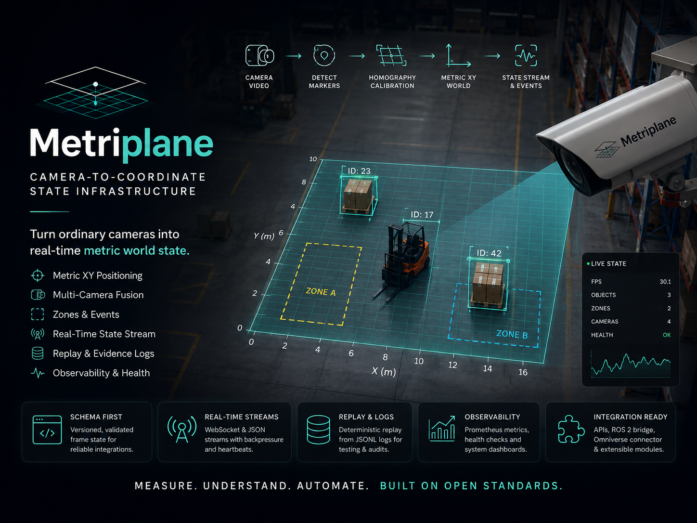

<!--
SPDX-FileCopyrightText: 2025-2026 Miko Parkkinen
SPDX-License-Identifier: MIT
-->

<p align="center">
  
</p>

# Metriplane

Open-source workcell black box for replayable physical evidence.

## Official Links

- Official site: https://www.metriplane.com/
- 3-minute v0.2.0 demo: https://www.youtube.com/watch?v=7U5nbBbGGbw
- v0.2.0 release: https://github.com/Miko997/metriplane/releases/tag/v0.2.0
- Zenodo DOI: https://doi.org/10.5281/zenodo.20736619
- External reproduction issue: https://github.com/Miko997/metriplane/issues/6
- Short feedback form: https://docs.google.com/forms/d/e/1FAIpQLSfnMZ4b3fSVVtwA89hZt3A09gf85eLfhW00FDD76TGRLNpirQ/viewform

## Summary

Metriplane v0.2.0 is an open-source physical-observability artifact for bounded workcells. It converts replayed or calibrated workcell state into physical event logs, Cell Truth Reports, portable evidence bundles, local bundle verification, and generated regression tests. The current release is observe-only and camera-free for reproduction.

## Evidence Workflow

```text
replayed workcell state
→ physical event
→ incident
→ Cell Truth Report
→ evidence bundle
→ bundle verification
→ generated regression test
```

## Current v0.2.0 Evidence Result

- 580 tests passed
- deterministic replay pass=true
- 6 physical events
- 1 incident
- 35.0 second missing-tool delay
- bundle verify: pass=true
- generated regression test: PASS

## Quick Reproduction Path

```bash
git clone https://github.com/Miko997/metriplane.git
cd metriplane
git checkout v0.2.0

python3 -m venv .venv
source .venv/bin/activate
pip install -e .

python -m metriplane.cli doctor
PYTEST_DISABLE_PLUGIN_AUTOLOAD=1 python -m pytest -q
./tools/mp.sh deterministic-replay

metriplane atlas validate-pack configs/domain_packs/assembly_cell

metriplane atlas run \
  --session-jsonl datasets/demo/atlas/assembly_cell_missing_tool.jsonl \
  --pack configs/domain_packs/assembly_cell \
  --out runs/atlas/assembly_cell_missing_tool

metriplane atlas bundle verify \
  runs/atlas/assembly_cell_missing_tool/evidence_bundles/INC-0001.zip

metriplane atlas test \
  runs/atlas/assembly_cell_missing_tool/regression_tests/INC-0001.yaml
```

## What Metriplane Is

- observe-only
- local-first
- replay/camera-oriented
- bounded workcell scoped
- research-software oriented
- focused on evidence, not robot control

## What Metriplane Does Not Claim

- no robot or machine control
- no safety certification
- no quality-release approval
- no people recognition
- no marker-free tracking claim
- no full 3D reconstruction claim
- no production-factory deployment validation
- no factory-wide deployment readiness

## Relationship to ROS Bags and Logs

Robotics teams often debug incidents using recorded sensor data, ROS bags, logs, traces, and simulation replays. Those artifacts are valuable raw evidence. Metriplane is not a replacement for ROS bags or logs. It explores the next structured layer: incident context, evidence bundle, verification result, and generated regression test.

## External Feedback

External technical feedback and public discussion links are collected on the official site:

https://www.metriplane.com/feedback/

## Citation / DOI

If you use or evaluate Metriplane v0.2.0, cite the archived release:

https://doi.org/10.5281/zenodo.20736619

## Repository Orientation

The public Python package and command-line entry points remain named `metriplane`.

| Area | Path | Purpose |
|---|---|---|
| Package | `metriplane/` | Python package and CLI implementation |
| Domain packs | `configs/domain_packs/` | Workcell-specific Atlas configuration |
| Demo datasets | `datasets/demo/` | Checked-in replay inputs for reproduction |
| Evidence | `evidence/` | Release evidence, manifests, and experiment artifacts |
| Tools | `tools/` | Supported local helper scripts |
| Docs | `docs/` | Technical documentation and runbooks |
| Web UI | `web/` | Local operator and review interfaces |

## Key Local Commands

```bash
python -m metriplane.cli doctor
PYTEST_DISABLE_PLUGIN_AUTOLOAD=1 python -m pytest -q
./tools/mp.sh deterministic-replay

metriplane atlas validate-pack configs/domain_packs/assembly_cell
metriplane atlas run \
  --session-jsonl datasets/demo/atlas/assembly_cell_missing_tool.jsonl \
  --pack configs/domain_packs/assembly_cell \
  --out runs/atlas/assembly_cell_missing_tool
metriplane atlas bundle verify \
  runs/atlas/assembly_cell_missing_tool/evidence_bundles/INC-0001.zip
metriplane atlas test \
  runs/atlas/assembly_cell_missing_tool/regression_tests/INC-0001.yaml
```

## Documentation

- Atlas evidence workflow: [docs/atlas/README.md](docs/atlas/README.md)
- Physical observability scope: [docs/physical_observability.md](docs/physical_observability.md)
- Development setup: [docs/development.md](docs/development.md)
- Prerequisites: [docs/PREREQUISITES.md](docs/PREREQUISITES.md)
- Evidence matrix: [docs/eval/evidence_matrix.md](docs/eval/evidence_matrix.md)
- Integration notes: [docs/INTEGRATIONS.md](docs/INTEGRATIONS.md)

## License

MIT License. See [LICENSE](LICENSE).
