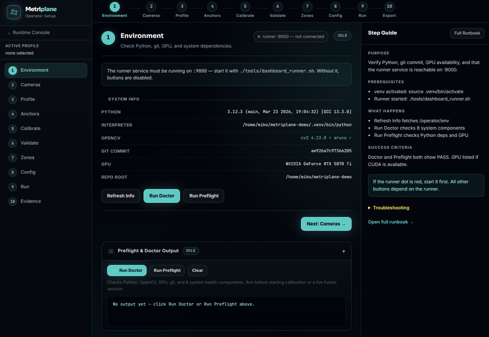
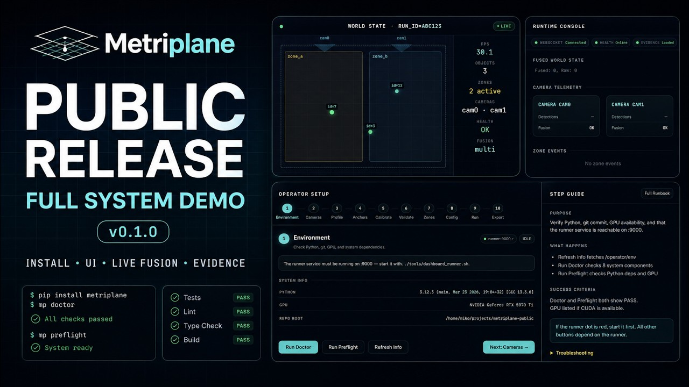
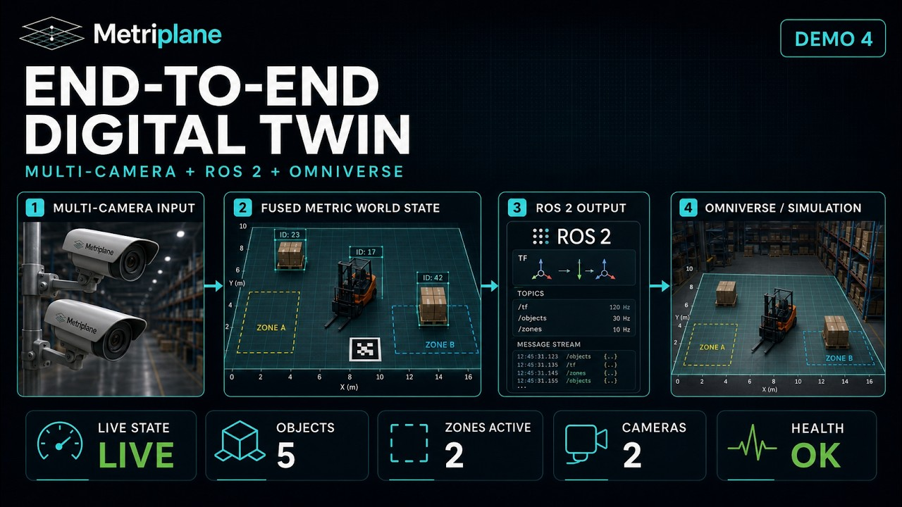
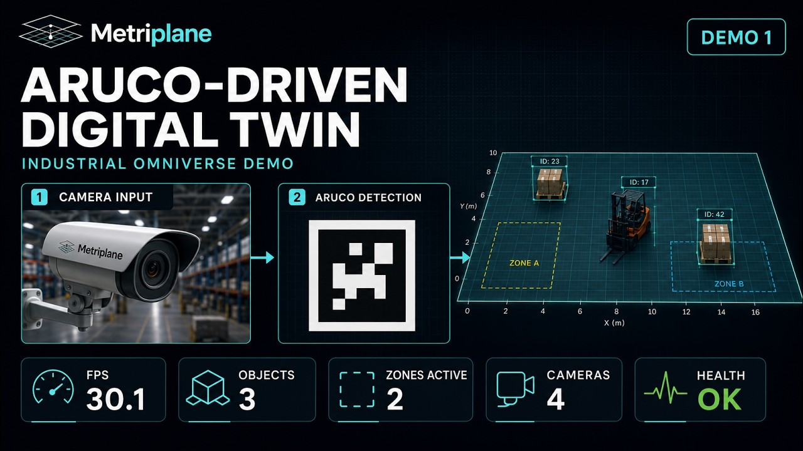
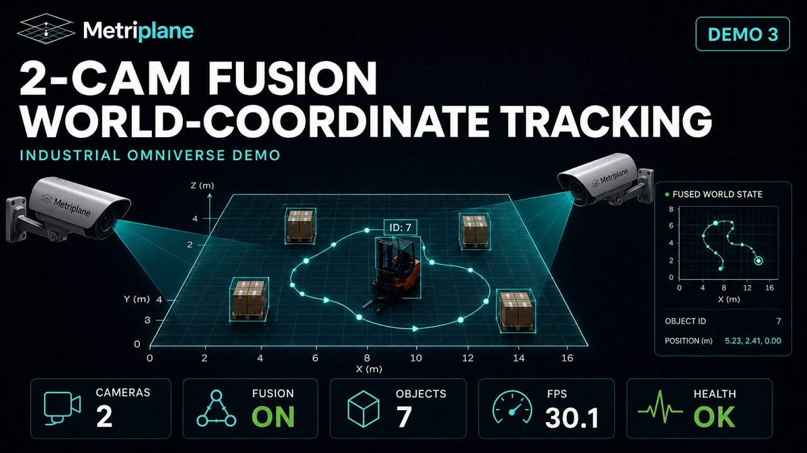

<!--
SPDX-FileCopyrightText: 2025-2026 Miko Parkkinen
SPDX-License-Identifier: MIT
-->

<p align="center">
  
</p>

<h1 align="center">MetriPlane</h1>

<p align="center">
  <strong>Open-source physical observability for workcells: replayable evidence bundles, regression tests, and read-only operator review from calibrated planar state.</strong>
</p>

<p align="center">
  <a href="https://github.com/Miko997/metriplane/actions/workflows/ci.yml">
    
  </a>
  <a href="LICENSE">
    
  </a>
  <a href="https://www.python.org/">
    
  </a>
</p>

<p align="center">
  <a href="#quickstart">Quickstart</a> ·
  <a href="#operator-dashboard">Operator Dashboard</a> ·
  <a href="#evidence-review">Evidence Review</a> ·
  <a href="#citation">Citation</a> ·
  <a href="#public-release">Release</a> ·
  <a href="#benchmark-evidence-and-reproducibility">Evidence</a> ·
  <a href="#installation">Setup</a> ·
  <a href="#documentation">Docs</a>
</p>

---

## Citation

MetriPlane v0.2.0 is the current release and the main SoftwareX paper artifact.
It adds Sentinel, Atlas Evidence Review, and observe-only physical-space
auditing while preserving the historical v0.1.3/v0.1.4 benchmark and Zenodo
evidence lineage.

The historical DOI-archived baseline is v0.1.4.
[](https://doi.org/10.5281/zenodo.20631037)

Please cite the v0.2.0 paper artifact as:

Parkkinen, M. (2026). *MetriPlane v0.2.0: Open-Source Physical Observability for Workcell Evidence, Replay, and Regression Testing*.

---

## Public release

Current release: `v0.2.0`.

The v0.2.0 release expands MetriPlane from camera-to-coordinate streaming into
an observe-only physical-observability platform: named objects, trace summaries,
spatial contracts, incidents, replayable evidence bundles, physical regression
tests, camera trust, experimental local forecast reports, experimental grounded
evidence Q&A, and the Command Center UI.

The earlier v0.1.3 release remains the historical benchmark-evidence release,
and v0.1.4 remains the historical DOI-archived repository-stabilized baseline.
The v0.2.0 release is the main SoftwareX paper artifact. Benchmark evidence is
treated as supplemental release evidence, not as a peer-reviewed publication.

---

## Why MetriPlane?

| Feature | What it means |
|---|---|
| 📷 **Any USB or RTSP camera** | No LiDAR, no depth sensor — a printed ArUco board and a USB camera are enough |
| 📐 **Metric world coordinates** | Pixel positions mapped to real-world cm/m via planar homography |
| 🔀 **Multi-camera fusion** | Kalman-filtered sensor fusion across multiple views |
| 🗺️ **Zone analytics** | Polygon zones with enter / exit / dwell event streams |
| 🧭 **Sentinel observe-only auditing** | Spatial contracts, incidents, forecasts, evidence bundles, and regression tests without robot-control integration |
| 📡 **WebSocket streaming** | Real-time `FrameStateModel` JSON on `ws://host:8765` |
| 🎞️ **Deterministic replay** | Bit-exact JSONL replay for regression testing and demos |
| 🖥️ **Operator dashboard** | Browser-based wizard: scan cameras → calibrate → run → export |
| 🧩 **Command Center** | Read-only operator view for map state, incidents, traces, trust, and grounded answers |
| 🧾 **Evidence Review** | Replayable physical event ledger, Cell Truth Report, incident archive, regression test, training case, and improvement action for one workcell |
| 🐳 **Docker ready** | One-command `docker-compose up` demo — no camera needed |
| 🔬 **Evidence-backed** | Benchmark claims backed by evidence artifacts, manifest rows, and checksums |
| ⚡ **GPU-optional** | CuPy backend for large workloads; CPU is default for small N (see [GPU Statement](#gpu-statement)) |

---

## Local MetriPlane Console

The browser-based console links the full local MetriPlane workflow: Operator Setup,
Live State, Sentinel Command Center, Evidence Review, and Integrations. After the
local stack is running, safe actions are available from the UI through
the allowlisted runner API.

<p align="center">
  
</p>

**Start the local console:**

```bash
metriplane start
# open http://localhost:8088/web/dashboard/index.html
# starts runner :9000 and dashboard :8088
# runtime stream, health/metrics :8000, and websocket :8765 start only with --live or from a run action
metriplane start --live
# also starts the runtime stream for live-state pages
```

Full runbook: [`docs/operator_ui_runbook.md`](docs/operator_ui_runbook.md) · Multi-camera setup: [`docs/dashboard_multicam_runbook.md`](docs/dashboard_multicam_runbook.md)

---

## Sentinel and Command Center

Sentinel is the 0.2.0 observe-only control-room layer. It evaluates spatial
contracts over camera-derived object state, records incidents, emits
experimental local forecast reports for near-future rule violations, scores
camera trust, and packages local evidence without touching robot or
machine-controller code.

```bash
metriplane sentinel run \
  --config configs/sentinel_demo.yaml \
  --run-id sentinel_demo_001 \
  --runs-dir ~/metriplane-runs

python -m http.server 8088 --directory web/dashboard
# open http://localhost:8088/index.html, then choose Command Center
```

Operator-facing docs:
[`docs/sentinel.md`](docs/sentinel.md),
[`docs/contracts.md`](docs/contracts.md),
[`docs/command_center_dashboard.md`](docs/command_center_dashboard.md),
[`docs/camera_trust.md`](docs/camera_trust.md), and
[`docs/operator_assistant.md`](docs/operator_assistant.md).

---

## Evidence Review

MetriPlane turns a replayed assembly-cell state stream into a physical event
ledger, Cell Truth Report, incident archive, generated regression test,
training case, and improvement action. The local tools also generate a static
dashboard, USD replay export, privacy report, connector payloads, SQLite
evidence index, multi-cell summary, protocol schemas, field review kit, and
claim audit.

```bash
metriplane atlas validate-pack configs/domain_packs/assembly_cell
metriplane atlas run \
  --session-jsonl datasets/demo/atlas/assembly_cell_missing_tool.jsonl \
  --pack configs/domain_packs/assembly_cell \
  --out runs/atlas/assembly_cell_missing_tool
metriplane atlas bundle verify runs/atlas/assembly_cell_missing_tool/evidence_bundles/INC-0001.zip
metriplane atlas test runs/atlas/assembly_cell_missing_tool/regression_tests/INC-0001.yaml
metriplane atlas dashboard build --run-dir runs/atlas/assembly_cell_missing_tool
metriplane atlas lake build --root runs/atlas --db runs/atlas/evidence_lake.sqlite
```

Evidence Review is observe-only and asset/process focused. It does not control robots or
machines, certify safety, approve quality release, recognize people, or claim
marker-free tracking.

Docs: [`docs/atlas/README.md`](docs/atlas/README.md).

---

## Demo Gallery

<table>
<tr>
<td width="50%" valign="top">
<a href="https://www.youtube.com/watch?v=X4nyYcNFQhM">
  
</a>
<br><b>Camera-first planar tracking</b>
</td>
<td width="50%" valign="top">
<a href="https://www.youtube.com/watch?v=q20j5-Owd4w">
  
</a>
<br><b>Metric mapping workflow</b>
</td>
</tr>
<tr>
<td width="50%" valign="top">
<a href="https://www.youtube.com/watch?v=xfuW-MVuphE">
  
</a>
<br><b>Multi-camera fusion</b>
</td>
<td width="50%" valign="top">
<a href="https://www.youtube.com/watch?v=tQvOO5kANqw">
  
</a>
<br><b>Zone analytics and streaming</b>
</td>
</tr>
</table>

## Quickstart

### Option A: Demo replay (no camera needed)

```bash
git clone https://github.com/Miko997/metriplane.git
cd metriplane
python3 -m venv .venv && source .venv/bin/activate
pip install -e .
./tools/mp.sh deterministic-replay   # replay included demo dataset
```

### Option B: Docker (fastest start)

```bash
./tools/docker_demo_up.sh            # start dummy-mode backend
curl http://localhost:8000/health | jq
./tools/docker_clean.sh              # clean up
```

Historical Docker proof validates dummy-mode startup, health, and WebSocket
message flow in `evidence/experiments/docker_demo_proof_001.md`. The
v0.2.0 paper package also captures a Docker dummy-mode local smoke: build/start,
health endpoint JSON, and cleanup logs. This is bounded smoke evidence only and
is not promoted as benchmark, production-runtime, live-camera, replay-mode,
reliability, or safety evidence.

See [`docker/docker_quickstart.md`](docker/docker_quickstart.md) for live-camera mode and GPU pass-through.

### Option C: Live camera

```bash
source .venv/bin/activate
./tools/mp.sh preflight              # verify system
./tools/mp.sh run-fusion cpu 30 my_run_001  # 30 second live session
```

Then open the Operator Dashboard (see above) to calibrate and monitor.

---

## Architecture

```
USB/RTSP Camera → ArUco Detection → Planar Mapping → Fusion → Tracking/Zones → WebSocket/JSONL
```

| Component | Module | Description |
|---|---|---|
| Camera ingest | `metriplane/camera/` | USB (v4l2), RTSP, multi-camera |
| ArUco detection | `metriplane/backends/` | Marker detection with stable IDs |
| Planar mapping | `metriplane/mapping/` | Homography: pixel → world meters |
| Fusion | `metriplane/pipeline/` | Nearest / weighted / Kalman strategies |
| Zone analytics | `metriplane/zones.py` | Polygon zones, enter/exit/dwell events |
| Streaming | `metriplane/streaming/` | WebSocket `ws://host:8765` |
| Recording | `metriplane/recording/` | JSONL for deterministic replay |
| Health | `metriplane/system/` | Component-level health registry |
| Compute backend | `metriplane/compute/` | CPU (NumPy) or GPU (CuPy) |

The canonical Python package is `metriplane/`. Root `tools/` contains the supported command-line helper scripts, `configs/` contains runtime configs, and moved experiment examples live in `configs/examples/`.

**Output endpoints:**

| Endpoint | Format | Description |
|---|---|---|
| `ws://host:8765` | JSON | Real-time `FrameStateModel` per frame |
| `http://host:8000/metrics` | Prometheus | Frame rate, object count, health scores |
| `http://host:8000/health` | JSON | Per-component health status |
| `RUNS/RUN_ID/session.jsonl` | JSONL | Full session recording for replay |

---

## Benchmark evidence and reproducibility

The benchmark evidence table is maintained in [`docs/eval/CANONICAL_EVIDENCE.md`](docs/eval/CANONICAL_EVIDENCE.md). For Paper B, the authoritative metric table is docs/eval/CANONICAL_EVIDENCE.md in release v0.1.3. Other summaries are non-authoritative convenience summaries. Benchmark claims are anchored to the public evidence campaign and direct artifacts listed below. Large JSONL sessions are not stored in Git; their hashes are recorded in [`evidence/manifest.csv`](evidence/manifest.csv).

| Benchmark result | Reported value | Direct artifact | Regenerate / verify |
|---|---:|---|---|
| Latency / update rate | 4,387 timing samples; detect.cam0 p95 1.242 ms; detect.cam1 p95 1.684 ms; fuse p95 0.184 ms; non-pacing pipeline p95 ≈3.55 ms | [`latency_summary.csv`](evidence/experiments/latency_summary.csv), [`latency_summary.md`](docs/eval/latency_summary.md) | `METRIPLANE_EVIDENCE_OUT=1 ./tools/mp.sh timing-breakdown` |
| Mapping error | 0.63 cm mean; 1.07 cm max; 9 grid points | [`mapping_error_001.csv`](evidence/experiments/mapping_error_001.csv) | `python benchmarks/run_mapping_error.py --help` |
| Static fiducial continuity | IDs 4, 7, and 12: 100.0% coverage over 4,387 frames; 0 missing gaps | [`id_stability_001.csv`](evidence/experiments/id_stability_001.csv) | `python tools/analyze_id_stability_jsonl.py SESSION_JSONL --out evidence/experiments/id_stability_001.csv` |
| Motion fiducial continuity | 98.39-99.25% primary-marker coverage over 88,475 frames; max gap 533 frames | [`id_stability_movement_001.csv`](evidence/experiments/id_stability_movement_001.csv), [`stability_summary.md`](docs/eval/stability_summary.md) | `python tools/analyze_id_stability_jsonl.py SESSION_JSONL --out evidence/experiments/id_stability_movement_001.csv` |
| Replay determinism | 302 frames; 906 object pairs; 0.0 cm max positional difference; 0 event mismatches | [`replay_determinism.csv`](evidence/experiments/replay_determinism.csv), [`manifest.csv`](evidence/manifest.csv) | `METRIPLANE_EVIDENCE_OUT=1 ./tools/mp.sh deterministic-replay` |
| Backpressure / overload behavior | 120 Hz synthetic input; queue_max=5; KEEP_LATEST; 3,600 generated; 995 published; 2,605 dropped; p95 latency 69.830 ms | [`backpressure_summary.csv`](evidence/experiments/backpressure_summary.csv), [`backpressure_001.csv`](evidence/experiments/backpressure_001.csv) | `METRIPLANE_EVIDENCE_OUT=1 ./tools/mp.sh backpressure` |
| Fusion jitter | 0.067-0.080 mm jitter std; 100.0% coverage; absolute fused accuracy not measured | [`fusion_jitter_001.csv`](evidence/experiments/fusion_jitter_001.csv), [`benchmark_summary.md`](docs/eval/benchmark_summary.md) | `python benchmarks/run_fusion_jitter.py SESSION_JSONL --out evidence/experiments/fusion_jitter_001.csv` |
| CPU/GPU equivalence | 13,161 samples; 0.0 cm RMSE diff; 0.0 cm max diff | [`compute_equivalence_001.csv`](evidence/experiments/compute_equivalence_001.csv) | `python benchmarks/run_compute_equivalence.py --session-jsonl SESSION_JSONL --out-csv evidence/experiments/compute_equivalence_001.csv --method weighted --require-gpu` |
| CPU/GPU fusion performance | GPU backend correct but slower than CPU for tested N=1-1000 fusion-compute workloads; CPU remains default for current workloads | [`gpu_benchmark_001.csv`](evidence/experiments/gpu_benchmark_001.csv), [`gpu_summary.md`](docs/eval/gpu_summary.md) | `./tools/mp.sh gpu-benchmark` |
| Zone dwell / transitions | Four zones (`bl`, `br`, `tl`, `tr`); 877.85 object-seconds dwell; 112 transitions | [`case_study_1_movement_zone_dwell.csv`](evidence/experiments/case_study_1_movement_zone_dwell.csv), [`case_study_1_movement_zone_dwell_by_zone.csv`](evidence/experiments/case_study_1_movement_zone_dwell_by_zone.csv), [`case_study_1_movement_zone_transitions.csv`](evidence/experiments/case_study_1_movement_zone_transitions.csv), [`case_study_1_movement_zone_events.csv`](evidence/experiments/case_study_1_movement_zone_events.csv) | `python tools/zones_report_jsonl.py SESSION_JSONL --out evidence/experiments --prefix case_study_1_movement` |
| Docker / demo proof | Historical dummy-mode Docker proof exists; the v0.2.0 paper package also captures Docker dummy-mode local smoke: build/start, health endpoint JSON, and cleanup logs. Smoke evidence only; not benchmark, production-runtime, live-camera, replay-mode, reliability, or safety evidence. | [`docker_demo_proof_001.md`](evidence/experiments/docker_demo_proof_001.md), [`docs/paper/claim_evidence_table.md`](docs/paper/claim_evidence_table.md) | `./tools/docker_demo_up.sh` |
| Operator UI smoke evidence | Operator UI final smoke: 10-step workflow passed; 1,797 frames; analytics exported | [`operator_ui_final_smoke_001.md`](evidence/experiments/operator_ui_final_smoke_001.md) | See [`docs/operator_ui_runbook.md`](docs/operator_ui_runbook.md) |

For a compact artifact index, see [ARTIFACTS.md](ARTIFACTS.md). For the full evidence manifest, see [`evidence/manifest.csv`](evidence/manifest.csv).

---

## Integration

### WebSocket — primary integration surface

Connect any WebSocket client to `ws://host:8765`:

```python
import asyncio, websockets, json

async def main():
    async with websockets.connect("ws://localhost:8765") as ws:
        frame = json.loads(await ws.recv())
        print(frame["run_id"], len(frame["objects"]))

asyncio.run(main())
```

Schema documented in [`docs/schema.md`](docs/schema.md).

### NVIDIA Omniverse / Isaac

Export adapters under `integrations/isaac/` and `integrations/omniverse/`
convert replay traces into USD/OpenUSD scenes for inspection. These are replay
and adapter surfaces unless separately measured. See
[`docs/isaac_omniverse_replay.md`](docs/isaac_omniverse_replay.md).

### ROS 2

The `integrations/ros2/metriplane_ros/` package adapts MetriPlane frame state
and alert events into ROS 2-friendly messages. It is an adapter, not a robot
controller. See [`docs/ros2_bridge.md`](docs/ros2_bridge.md).

---

## Installation

```bash
python3 -m venv .venv
source .venv/bin/activate

pip install -e .                      # core package
pip install -e .[gpu-cuda13x]         # optional: GPU backend (requires CUDA 12.x / 13.x + CuPy)
pip install -e .[plots]               # optional: benchmark plotting

python -m metriplane.cli doctor       # verify install
```

**Prerequisites**: Ubuntu 24.04 (tested), Python 3.12+, OpenCV, v4l2 (USB cameras).
Full details: [`docs/PREREQUISITES.md`](docs/PREREQUISITES.md)

---

## Running Tests

```bash
source .venv/bin/activate
pip install pytest pytest-asyncio pydantic websockets   # if not already installed
PYTEST_DISABLE_PLUGIN_AUTOLOAD=1 python -m pytest -q
```

> **Note**: The `PYTEST_DISABLE_PLUGIN_AUTOLOAD=1` flag prevents conflicts with ROS 2 pytest plugins if installed system-wide. See [`docs/development.md`](docs/development.md) and [`docs/PREREQUISITES.md`](docs/PREREQUISITES.md) for troubleshooting details.

---

## Running the Demo

```bash
./tools/mp.sh demo-all 5                  # full feature showcase, ~5 s per scenario

# Individual scenarios:
./tools/mp.sh deterministic-replay        # bit-exact replay
./tools/mp.sh backpressure               # bounded queue under overload
./tools/mp.sh provenance                 # config hash + git commit stamping
./tools/mp.sh timing-breakdown           # per-stage latency profile
./tools/mp.sh gpu-smoke                  # GPU availability check
./tools/mp.sh gpu-benchmark              # CPU vs GPU comparison
```

Demo-generated CSV and checksum artifacts are written under `runs/demo-evidence/` by default. Set `METRIPLANE_EVIDENCE_OUT=1` when intentionally regenerating canonical evidence under `evidence/experiments/`.

---

## Running Live Camera Mode

```bash
./tools/mp.sh preflight                  # 1. verify system

# 2. open Operator Dashboard for guided calibration
metriplane start --operator
# http://localhost:8088/web/dashboard/operator.html -> Step 5: Calibrate

./tools/mp.sh run-fusion cpu 60 session_001   # 3. run fusion (60 s)
```

See [`docs/calibration_runbook.md`](docs/calibration_runbook.md) and [`docs/operator_ui_runbook.md`](docs/operator_ui_runbook.md).

---

## Key Commands Reference

```bash
# System checks
./tools/mp.sh preflight                        # environment health check
python -m metriplane.cli doctor                # import + dependency check

# Run fusion
./tools/mp.sh run-fusion cpu 30 run_001        # 30 s CPU session
./tools/mp.sh run-fusion gpu 30 run_002        # 30 s GPU session (requires CuPy)

# Validation scenarios
./tools/mp.sh deterministic-replay             # bit-exact replay test
./tools/mp.sh backpressure                     # bounded-queue load test
./tools/mp.sh health-degrade-cam1              # graceful degradation test
./tools/mp.sh provenance                       # provenance stamping test
./tools/mp.sh timing-breakdown                 # per-stage latency profile
./tools/mp.sh gpu-smoke                        # GPU smoke test
./tools/mp.sh gpu-equivalence                  # CPU vs GPU output equality
./tools/mp.sh gpu-benchmark                    # CPU vs GPU performance

# Evidence Review
metriplane atlas validate-pack configs/domain_packs/assembly_cell
metriplane atlas run --session-jsonl datasets/demo/atlas/assembly_cell_missing_tool.jsonl --pack configs/domain_packs/assembly_cell --out runs/atlas/assembly_cell_missing_tool
metriplane atlas bundle verify runs/atlas/assembly_cell_missing_tool/evidence_bundles/INC-0001.zip
metriplane atlas test runs/atlas/assembly_cell_missing_tool/regression_tests/INC-0001.yaml

# Docker
./tools/docker_demo_up.sh                      # start dummy-mode Docker demo
./tools/docker_live_up.sh                      # start live camera mode
./tools/docker_stop.sh                         # stop containers
```

**Environment overrides:**

```bash
METRIPLANE_VENV=~/my-venv              # venv path (default: <repo>/.venv)
RUNS=/path/to/metriplane-runs          # output directory (default: <repo>/runs)
METRIPLANE_EVIDENCE_OUT=1              # opt in to evidence/experiments outputs
CONFIG=configs/my.yaml                 # config file
METRIPLANE_COMPUTE_BACKEND=gpu         # force GPU backend
METRIPLANE_TIMING=1                    # enable per-stage timing
```

Experiment-oriented sample configs are kept in `configs/examples/`.

---

## Documentation

| Document | Purpose |
|---|---|
| [`docs/PREREQUISITES.md`](docs/PREREQUISITES.md) | System requirements, dependency install |
| [`docs/development.md`](docs/development.md) | Dev setup, code quality, contribution guide |
| [`docs/calibration_runbook.md`](docs/calibration_runbook.md) | Camera calibration step-by-step |
| [`docs/operator_ui_runbook.md`](docs/operator_ui_runbook.md) | Web dashboard operator guide |
| [`docs/dashboard_multicam_runbook.md`](docs/dashboard_multicam_runbook.md) | Multi-camera dashboard setup |
| [`docs/physical_observability.md`](docs/physical_observability.md) | Architecture and claim boundaries |
| [`docs/object_registry.md`](docs/object_registry.md) | Named objects, types, tags, and registry loading |
| [`docs/trace_store.md`](docs/trace_store.md) | Trace summaries, speed/dwell/idle metrics, and exports |
| [`docs/events.md`](docs/events.md) | Operational event and alert schema |
| [`docs/contracts.md`](docs/contracts.md) | Sentinel spatial contract language |
| [`docs/sentinel.md`](docs/sentinel.md) | Observe-only Sentinel runtime |
| [`docs/command_center_dashboard.md`](docs/command_center_dashboard.md) | Command Center operator UI/API |
| [`docs/atlas/README.md`](docs/atlas/README.md) | Evidence workflow quickstart, protocol, domain packs, and limits |
| [`docs/schema.md`](docs/schema.md) | `FrameStateModel` v1.0 field reference |
| [`docs/frames.md`](docs/frames.md) | Coordinate systems: pixel, camera, world |
| [`docs/backpressure.md`](docs/backpressure.md) | Bounded queue design |
| [`docs/gpu_setup.md`](docs/gpu_setup.md) | CUDA / CuPy setup |
| [`docs/gpu_compute_backend.md`](docs/gpu_compute_backend.md) | GPU backend architecture |
| [`docs/INTEGRATIONS.md`](docs/INTEGRATIONS.md) | WebSocket, Omniverse, ROS 2 integration |
| [`docs/eval/evidence_matrix.md`](docs/eval/evidence_matrix.md) | Full evidence matrix with artifacts |
| [`docs/eval/evidence_index.md`](docs/eval/evidence_index.md) | Evidence summary and known limitations |

---

## Scope, Limitations & Disclaimers

### What's in scope

| | |
|---|---|
| ✅ In scope | Camera ingest, ArUco detection, planar homography mapping, multi-camera fusion, zone analytics, WebSocket streaming, JSONL recording, Docker deployment |
| ✅ Verified integration surface | WebSocket stream (`ws://host:8765`) — measured and claimed |
| ⚡ Adapter surfaces | ROS 2, Isaac, Omniverse, exporters, and Jetson deployment are integration paths unless separately measured |
| ❌ Not in scope | Certified safety control, robot actuation, cloud dependency, non-ArUco markers, tracking without a calibrated board |

Do not expose the local runner on `:9000` to untrusted networks. It is a
localhost operator/development service with an allowlisted command API.

### GPU Statement

MetriPlane includes an optional CuPy GPU backend for fusion compute. The current public `gpu_benchmark_001.csv` includes real `gpu_cupy` timing rows and shows the GPU backend is numerically valid but slower than CPU for the tested N=1-1000 fusion-compute workloads. CPU remains the default backend for current workloads; GPU remains optional for larger future batched workloads. This benchmark covers fusion compute only, not camera capture, ArUco detection, mapping, WebSocket streaming, JSONL recording, or full-pipeline acceleration.

Measured results: [`docs/gpu_compute_backend.md`](docs/gpu_compute_backend.md) · [`evidence/experiments/gpu_benchmark_001.csv`](evidence/experiments/gpu_benchmark_001.csv)

### Known Limitations

- **Onboarding evidence** (`evidence/onboarding/onboarding_001.md`) was performed on the development machine with a warm pip cache — install time on a cold cache will be slower.
- **Fusion jitter** (`fusion_jitter_001.csv`): `max_error_m` is NaN — ground-truth absolute position comparison was not run. Jitter stability (std) is measured and reported.
- **Large session files** (JSONL) are not included in git due to size; SHA256 checksums are in `evidence/manifest.csv`.
- **Sentinel** is observe-only. It emits events, incidents, forecasts, and evidence; it is not a certified safety controller and does not actuate robots or machines.
- **Evidence Review** is observe-only and asset/process focused. It does not control machines, certify safety, approve quality release, recognize people, or claim marker-free tracking.
- **ROS 2, Isaac, Omniverse, Jetson, and exporter paths** are integration/deployment surfaces unless a specific checked-in evidence artifact says otherwise.
- **Command Center and Evidence Review are operator review tools**, not production collision-avoidance, certified safety, or quality-release systems.

---

## Development

```bash
ruff check .                                      # linting
mypy metriplane/                                  # type checking
pre-commit install && pre-commit run --all-files  # pre-commit hooks
python benchmarks/run_replay_determinism.py --help
```

---

## License

MIT License — see [LICENSE](LICENSE).

---

## Support

- **Issues**: [GitHub Issues](https://github.com/Miko997/metriplane/issues) for bugs and feature requests
- **Questions**: [GitHub Discussions](https://github.com/Miko997/metriplane/discussions)
- **Docs**: start with [`docs/PREREQUISITES.md`](docs/PREREQUISITES.md) for setup, [`docs/operator_ui_runbook.md`](docs/operator_ui_runbook.md) for the dashboard

---

*MetriPlane — open-source physical observability for workcell evidence, replay, and regression testing.*
