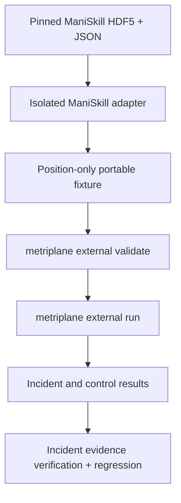

<!-- SPDX-FileCopyrightText: 2026 Miko Parkkinen -->
<!-- SPDX-License-Identifier: MIT -->

# Metriplane ManiSkill PickCube External Fixture Proof

- Proof version: `1`
- Publication status: **candidate, not yet published**
- Frozen publication date: `2026-08-12`
- Starting baseline: `1549d0a05e03db51efc0ee08edb7d9db66196b4e`
- Proposed immutable tag: `maniskill-pickcube-proof-v1`

## 1. What this is

This directory is the public review candidate for one bounded Metriplane
evaluation made from one exact, official ManiSkill `PickCube-v1`
demonstration episode. It joins the already checked-in incident and control
fixtures to machine-readable provenance, representative results, checksums,
reproduction instructions, claim limits, and an evaluator packet.

This is an owner-generated public technical proof. It is not independent
reproduction, external validation, external adoption, or ManiSkill
endorsement. The raw ManiSkill source files and simulator assets are referenced
but are not included.

## 2. Exact bounded claim

One pinned official ManiSkill demonstration episode, episode `0` / HDF5 group
`traj_0`, was restored through named ManiSkill APIs and normalized into 75
complete, position-only planar Metriplane frames containing the cube and Panda
TCP. Metriplane evaluated those same frames and the same operator-configured
target polygon under two relative wait rules. A `0.20 s` wait produced the
recorded incident result; a `0.30 s` wait produced the recorded no-incident
control result.

This claim concerns bounded XY occupancy and timing under Metriplane-authored
rules. It does not concern official PickCube success or failure, grasping, 3D
placement, orientation, physical accuracy, simulator realism, safety, or
production fitness.

## 3. Source-to-result flow

## 4. Exact source identity

The conversion runtime and the earlier dataset-generation runtime are separate
identities.

| Identity | Frozen value |
| --- | --- |
| Source project | `mani-skill/ManiSkill` |
| Dataset repository | `haosulab/ManiSkill_Demonstrations` |
| Dataset revision | `d674485bbffdd533914e52d272fdda34c0515608` |
| Task | `PickCube-v1` |
| Conversion release / package | ManiSkill `v3.0.1` / `mani_skill==3.0.1` |
| Conversion source commit | `a4a4f9272ad64b1564035874b605ceb687b63ed8` |
| Conversion wheel SHA-256 | `685de2f03c300b1ede49881a1bf6306ad062082d39c8d3be8b8e85603f32e33a` |
| Dataset-generation package | ManiSkill `3.0.0b4` |
| Dataset-generation commit | `652ad9353c0223507a938f0e8d990dd6f1c771ad` |
| Adapter ID / version | `org.metriplane.maniskill_pickcube` / `1.0.0` |
| Public adapter commit | `95d1134d9fb9273318c552c507952f1c5c26877e` |
| Adapter dependency-lock SHA-256 | `f28f8618680de09c94e855a8b5d2a995ab6241b96c462650cada9c896335ec80` |
| External Source Contract | `metriplane.external_source_contract.v1` |
| Contract profile | `metriplane.atlas.complete_snapshot.v1` |
| Contract-schema SHA-256 | `b5544012d7d98f1fdc8aed56192c33ac16f4acebd6694778ad682743482722c4` |
| FrameStateModel | `1.0` |
| Repository package version | `0.3.0` |
| MET-15 correction merge / MET-16 baseline | `1549d0a05e03db51efc0ee08edb7d9db66196b4e` |
| Exact proof build commit | Recorded in `proof-record.json`; not final until this candidate is merged |

Every source conversion rejects a byte-size or SHA-256 mismatch:

| Referenced upstream artifact | Bytes | SHA-256 |
| --- | ---: | --- |
| `demos/PickCube-v1.zip` | 36,590,010 | `b2d4afb30fa309755862b98c342e6ee18918253c93f3bbac16ed6670748f26d8` |
| `demos/PickCube-v1/motionplanning/trajectory.h5` | 29,349,195 | `03ca60546541a7f18321d9d32721f0254bc75217828c0cadacd217d0c014576a` |
| `demos/PickCube-v1/motionplanning/trajectory.json` | 228,218 | `16e403cb77bfbdda28c243b96eb90adbae1c0edf42854283be57ee47076a2e90` |

## 5. Episode and state accounting

| Accounted item | Value |
| --- | ---: |
| Selected episode | `0` |
| HDF5 group | `traj_0` |
| Source transitions | `74` |
| Stored source states | `75` |
| Normalized frames, IDs `0` through `74` | `75` |
| Objects in every frame | `2` (`cube_1`, `robot_tcp_1`) |
| Registered RL horizon | `50` (provenance only) |
| Authoritative step | `50,000,000 ns` (`0.05 s`, 20 Hz) |
| Cube target-region entry | frame `66`, `3.30 s` |
| TCP target-region entry | frame `71`, `3.55 s` |
| Missing-tool interval | `0.25 s` |

The 50-step RL horizon does not truncate the fixture. All 75 stored states are
retained. Episode selection was outcome-blind within an official corpus that
had already been success-filtered upstream; this episode is not an unbiased
sample of PickCube behavior.

## 6. Trust-layer table

| Layer | What it contains | What it may establish |
| --- | --- | --- |
| A: source facts | Pinned ZIP, HDF5, JSON, episode identity, stored states, and named restored poses | Identity and content of the referenced source |
| B: adapter-derived facts | State restoration, entity selection, XY projection, fixed clock, normalization report, and fixture hashes | How the portable fixture was produced |
| C: operator-configured rules | Target polygon, inclusive boundary, overlap rejection, outside label, and `0.20` / `0.30 s` waits | The exact Metriplane evaluation conditions, not ManiSkill task truth |
| D: Metriplane-derived results | Validation summaries, events, deviation, incident, evidence bundle, and regression result | Outcomes of Atlas under the supplied fixture and rules |

Source reward, success, termination, truncation, actions, and horizon metadata
are excluded from normalized inputs and Atlas incident truth.
`expected-outcome.json` is test metadata only and is never Atlas input.

## 7. Position-only normalization

Each source state is restored independently through named APIs. The adapter
reads `cube.pose`, `agent.tcp_pose`, and `goal_site.pose`; it does not step the
simulator or integrate actions. Only the cube and TCP become normalized
objects. Source world X/Y are copied without translation, rotation, scaling, or
axis swapping, and normalized Z is set to `0.0`.

The fixture deliberately discards source Z, complete quaternions, yaw, roll,
pitch, velocities, actions, grasp/contact state, most articulation state,
reward, success/failure, termination/truncation, and rendering material. There
is no interpolation, resampling, carry-forward, confidence fabrication, or
source annotation used as an event. The goal pose remains inert provenance and
operator rationale; it is not emitted as a process object.

The byte-identical incident/control session SHA-256 is
`7302878b71b145df634fca84db321804b02764312584db43af6ad9e945f452df`.
The entity-mapping SHA-256 is
`9127535a2e8eb3091aeac82f335e001f81c3a9e5098272881f7969c6eeecbee7`.

## 8. Incident/control comparison

Both variants use the same normalized session, entity mapping, and inclusive
square. The polygon is wholly operator-configured:

- `(0.016815734803676603, -0.01198131799697876)`
- `(0.03681573480367661, -0.01198131799697876)`
- `(0.03681573480367661, 0.00801868200302124)`
- `(0.016815734803676603, 0.00801868200302124)`

Its center is
`(0.026815734803676605, -0.0019813179969787598)` metres, its half-extent
is `0.010000000 m`, its boundary is inclusive, overlaps are rejected, and
points outside it receive `outside_workspace`. The polygon is not a ManiSkill
task-success region.

| Variant | Relative wait | Frames / events / deviations / incidents | Incident-derived artifacts |
| --- | ---: | --- | --- |
| Incident | `0.20 s` | `75 / 4 / 1 / 1` | One verified evidence bundle and one passing generated regression |
| Control | `0.30 s` | `75 / 3 / 0 / 0` | None, because no incident occurred |

The incident records `required_asset_missing` at frame `66`, `step_delayed`
at frame `70`, and `required_asset_present` plus `step_completed` at frame
`71`, producing one `missing_tool_caused_delay` incident. The control records
`required_asset_missing` at frame `66` and `required_asset_present` plus
`step_completed` at frame `71`; it has no delayed-step event or incident.

The fixture fingerprints, defined as the SHA-256 values of each finalized
`CHECKSUMS.sha256`, are:

- incident: `954a0ebbe3b541e12fedd91665484ff9561f0ae19fe63f83227379afe44413c2`;
- control: `8b3d26285f208bec42f8cb54401cda8d04c2c1e23fbeabb186eed6bd4c9dce1e`.

## 9. Published result summary

No final proof has been published yet. The publication candidate contains
machine-readable representative artifacts generated from the candidate commit
recorded in `proof-record.json`. Final-head identity and hashes remain a
publication gate until the candidate tree is frozen and rebuilt. The candidate
result is validation pass for both fixtures; incident counts
`75/4/1/1` with evidence verification and regression pass; control counts
`75/3/0/0` with no fabricated evidence or regression; three byte-identical
source conversions across 28 fixture artifacts; and three semantically
equivalent runs per variant.

The authoritative details are
[`proof-record.json`](proof-record.json),
[`artifacts/equivalence-summary.json`](artifacts/equivalence-summary.json), and
[`artifacts/environment-matrix.json`](artifacts/environment-matrix.json).
These are owner-generated technical results. CI jobs and owner-run checks are
not independent users.

The required portable installed-wheel matrix is Ubuntu/Python 3.12,
Ubuntu/Python 3.13, macOS/Python 3.12, and macOS/Python 3.13. Every row must
pass before publication. Exact runner versions, architectures, wheel identity,
commands, results, and limitations are recorded in
`artifacts/environment-matrix.json`; prose here does not override that record.

## 10. Fast portable reproduction

Level A is the primary evaluator path. It builds and installs a wheel from the
exact proof revision, validates and runs both frozen fixtures, verifies exact
counts, verifies the incident evidence bundle, executes its generated
regression, checks that the control created neither artifact, scans for local
path leaks, and writes `reproduction-result.json`.

It does not require ManiSkill, SAPIEN, Torch, h5py, Vulkan, the adapter, raw
source files, or robot assets. Follow [`REPRODUCE.md`](REPRODUCE.md#level-a--portable-fixture-evaluation).

Important package boundary: the published PyPI and conda-forge
`metriplane==0.3.0` artifacts do not contain the `metriplane external`
commands used here. The proof build also reports version `0.3.0`, but it is a
locally built wheel from the exact proof commit and must not be described as
the published v0.3.0 package. `METRIPLANE_GIT_COMMIT` records the exact tested
Git commit in durable run provenance.

## 11. Full source conversion reproduction

Level B is the advanced provenance-audit path. On Linux x86_64, it acquires the
immutable dataset revision, verifies the ZIP/HDF5/JSON identities, restores all
75 states through the pinned ManiSkill runtime, converts three clean roots,
finalizes byte-equivalence, compares the results with the tagged fixtures, and
confirms that source hashes remain unchanged.

It requires the isolated adapter environment, ManiSkill, SAPIEN, Torch, h5py,
and possibly a software Vulkan device. It does not render. Level B is not
required merely to rerun the portable Metriplane evaluation. See
[`REPRODUCE.md`](REPRODUCE.md#level-b--full-source-to-fixture-conversion).

## 12. Artifact and checksum table

`SHA256SUMS` is the canonical SHA-256 inventory. `proof-record.json` records
each artifact's media type, purpose, hash, and license classification. A hash
is accepted only when the corresponding `SHA256SUMS` line recomputes from the
same candidate tree.

| Artifact | Purpose | Exact SHA-256 record |
| --- | --- | --- |
| `artifacts/incident-validation.json` | Incident fixture validation | `SHA256SUMS` and `proof-record.json` |
| `artifacts/control-validation.json` | Control fixture validation | `SHA256SUMS` and `proof-record.json` |
| `artifacts/incident-run-summary.json` | Incident run summary | `SHA256SUMS` and `proof-record.json` |
| `artifacts/control-run-summary.json` | Control run summary | `SHA256SUMS` and `proof-record.json` |
| `artifacts/incident-evidence.zip` | Verified incident evidence archive | `SHA256SUMS` and `proof-record.json` |
| `artifacts/incident-regression.yaml` | Generated incident regression | `SHA256SUMS` and `proof-record.json` |
| `artifacts/incident-regression-result.json` | Regression execution result | `SHA256SUMS` and `proof-record.json` |
| `artifacts/equivalence-summary.json` | Conversion and run equivalence | `SHA256SUMS` and `proof-record.json` |
| `artifacts/environment-matrix.json` | Installed-wheel test matrix | `SHA256SUMS` and `proof-record.json` |
| `proof-record.json` | Proof identity and provenance | `SHA256SUMS` |
| `proof-record.schema.json` | Closed proof-record schema | `SHA256SUMS` and `proof-record.json` |
| `reproduce.py` | Standard-library Level-A evaluator | `SHA256SUMS` and `proof-record.json` |
| `REPRODUCE.md` | Level-A and Level-B instructions | `SHA256SUMS` and `proof-record.json` |
| `CLAIMS.md` | Supported, future-action, and prohibited claims | `SHA256SUMS` and `proof-record.json` |
| `READINESS.md` | Candidate publication decision | `SHA256SUMS` and `proof-record.json` |
| `NOTICE.md` | Rights and mixed-artifact boundary | `SHA256SUMS` and `proof-record.json` |
| `EVALUATOR.md` | Outside-evaluator packet | `SHA256SUMS` and `proof-record.json` |
| `evaluator-report-template.md` | Structured evaluator report | `SHA256SUMS` and `proof-record.json` |
| `CITATION.cff` | Proof citation metadata | `SHA256SUMS` and `proof-record.json` |

The control intentionally has no evidence ZIP or regression YAML because it
produced no incident. Absence is recorded, not represented by a placeholder.

## 13. Rights and attribution

The source project and dataset are attributed to ManiSkill and the
[pinned ManiSkill Demonstrations revision](https://huggingface.co/datasets/haosulab/ManiSkill_Demonstrations/tree/d674485bbffdd533914e52d272fdda34c0515608).
The dataset card declares Apache-2.0; no standalone dataset `LICENSE` was found
at that revision. The included normalized fixture coordinates are modified or
derived data treated under Apache-2.0 attribution and notice, separately from
Metriplane's MIT software and the independently authored MIT adapter/proof
documentation.

The raw ZIP, HDF5, JSON, Panda/table assets, URDF/GLB files, checkpoints,
screenshots, videos, and rendered images are absent. See [`NOTICE.md`](NOTICE.md)
for the mixed-artifact boundary.

## 14. Allowed claims

Only after all publication gates pass and the exact tagged tree and its hashes
are checked may the bounded claims in
[`CLAIMS.md`](CLAIMS.md#supported-by-the-public-proof) be used. In short:
one identified upstream episode was normalized into a contract-valid,
position-only fixture; all 75 stored states were retained; the two variants
share normalized state and geometry; only the relative wait changes the
recorded bounded result; and the portable evaluation does not require
ManiSkill.

## 15. Unsupported claims

This proof does not support official PickCube success or failure, grasp
failure, robot-control failure, 3D placement, orientation evaluation, physical
accuracy, simulator realism, sim-to-real validity, safety, certification,
production readiness, native or general ManiSkill compatibility, ManiSkill
endorsement, unbiased dataset sampling, independent reproduction, independent
adoption, external validation, or industry use. The complete register is in
[`CLAIMS.md`](CLAIMS.md#prohibited).

## 16. Current readiness decision

**NOT READY.**

The proof is a publication candidate. It cannot become READY until every
technical gate is recorded, every candidate URL resolves publicly, the focused
PR is reviewed and merged, post-merge workflows pass, Miko explicitly approves
publication, and the immutable annotated tag is created and verified. No
approval, merge, tag, external evaluation, or outreach is implied by this
candidate. See [`READINESS.md`](READINESS.md).

## 17. Canonical citation

The planned human citation, usable only after the immutable tag exists, is:

> Parkkinen, M. (2026). *Metriplane ManiSkill PickCube External Fixture Proof*, version 1. GitHub artifact, tag `maniskill-pickcube-proof-v1`. Metriplane, RRID:SCR_028813.

The RRID identifies the Metriplane resource, not this proof package by itself.
No DOI has been assigned to this proof. Until publication, cite neither the
proposed tag nor this candidate as a stable artifact.

## 18. Stable tagged URL

The planned canonical URL is:

`https://github.com/Miko997/metriplane/tree/maniskill-pickcube-proof-v1/proofs/maniskill-pickcube-v1`

The tag and URL do not exist yet. After explicit owner approval, merge,
post-merge verification, tag creation, and tag-workflow verification, this URL
must resolve to the exact immutable proof commit. The tag must never be moved.
